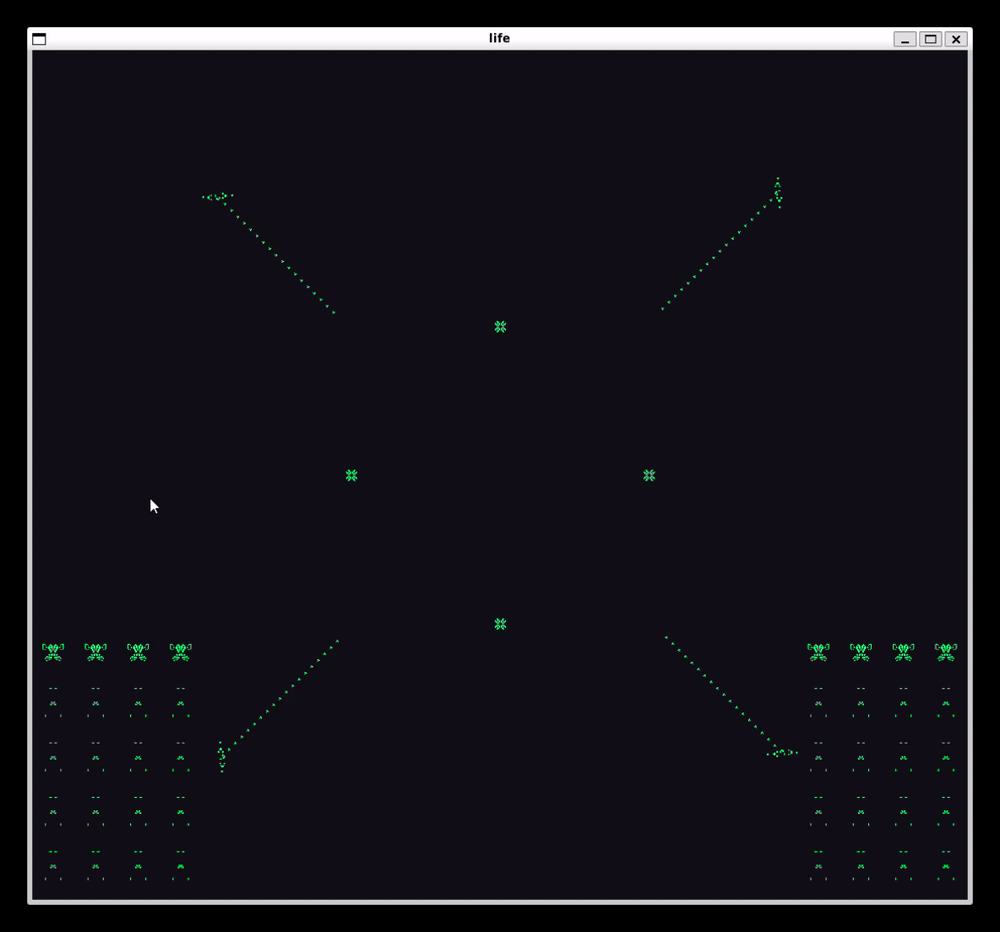

# Life

Conway's Game of Life, written in C following the 42 Norm, rendered with [minilibX](minilibx/). Initial conditions and the cellular-automaton rule are fully configurable, either through a config file or CLI flags.



## Build

This project links against X11/Xext through minilibX, so it needs a Linux environment with an X server. On Windows, build and run it from **WSL** (WSLg provides the display out of the box):

```sh
sudo apt-get install gcc make xorg libxext-dev libbsd-dev   # once, if missing
make
```

- `make` builds `minilibx/libmlx.a`, then `libft/libft.a`, then `life`.
- `make clean` removes object files (life's own, libft's, minilibx's).
- `make fclean` also removes the `life` binary and the two `.a` libraries.
- `make re` = `fclean` + `all`.
- `make debug` to compile with sanitizer, for memory bad usages.
## Run

```
./life <config_file> [options]
./life --random=WxH:PERCENT [options]
```

You need either a config file (which supplies the initial grid),

```sh
./life configs/railgun.cfg           # two Gosper glider guns, firing forever, never crossing paths
./life configs/glider.cfg            # 5 gliders on parallel diagonal tracks, never collide
./life configs/blinker.cfg           # 84 blinkers tiled across the board, in sync
./life configs/pulsar.cfg            # 6 pulsars (period-3 oscillator), tiled
./life configs/spaceship.cfg         # 4 lightweight spaceships cruising on parallel rows
```


or use `life` to build one on the fly. For example:

 ```sh
 ./life --random=200x200:15
 ./life --random=200x200:15 --cell=2
 ./life --random=200x200:15 --cell=2 --speed=8 --edge=torus --rule=B13/S23
 ./life --random=200x200:15 --cell=2 --speed=25 --edge=torus --rule=B13/S28
```

### Controls

| Key     | Action                              |
|---------|--------------------------------------|
| `ESC`   | quit                                  |
| `SPACE` | pause / resume                        |
| `N`     | advance one generation (while paused) |
| `R`     | reset to the initial pattern          |
| close (X) button | quit                         |

### CLI options

| Flag | Meaning |
|------|---------|
| `--rule=Bxxx/Sxxx` | life-like rule, e.g. `B3/S23` (Conway), `B36/S23` (HighLife) |
| `--random=WxH:PCT` | build a `W`x`H` grid, each cell alive with `PCT`% probability (0-100); needed if no config file is given |
| `--speed=ms` | milliseconds between generations |
| `--cell=px` | pixel size of one cell |
| `--edge=MODE` | grid topology (default `torus`) — see below |

`MODE` is one of:

| Mode | Geometry |
|------|----------|
| `finite` | cells outside the grid count as dead |
| `cylinder` | left/right edges wrap around normally, joining left to right (like a paper tube); the top/bottom axis stays finite - no vertical wrap |
| `torus` | opposite edges wrap around normally (donut) on both axes; accepts `wrap` as a deprecated alias |
| `mobius` | left/right edges wrap joining left to right just like `cylinder`, but the row is flipped top-to-bottom on the way (Möbius strip); the top/bottom axis stays finite - no vertical wrap |
| `klein` | left/right edges wrap with a flip like `mobius`, but top/bottom also wrap normally (Klein bottle) |
| `projective` | both pairs of edges wrap, each flipping the other axis (real projective plane) |

Flags override whatever the config file set. `--random` and a config file are mutually exclusive as the grid source (the first one seen wins).

## Config file format

```
# comment lines start with #
rule=B3/S23
cell_size=12
speed_ms=80
edge=torus
PATTERN
....................
....................
.........ooo........
....................
....................
```

- `rule=` — life-like rule string, `B<digits>/S<digits>`.
- `cell_size=` — pixel size of one cell in the window.
- `speed_ms=` — milliseconds between generations.
- `edge=` — `finite`, `cylinder`, `torus`, `mobius`, `klein` or `projective` (see above).
- `PATTERN` — marks the start of the grid. Everything after it, to the end
  of the file, is the initial pattern: one line per row, `o` for an alive
  cell and `.` for dead — no other symbols are recognized. The grid's
  width is the longest pattern line; shorter lines are padded with dead
  cells on the right, so the block doesn't need to be a perfect rectangle.
- `random=WxH:PCT` — build a random `W`x`H` grid instead of a `PATTERN`
  block, same format as `--random` on the CLI. A file uses **either**
  `random=` **or** `PATTERN`, never both — see `configs/conway_random.cfg`.

All keys are optional; anything not set falls back to a sane default
(`B3/S23`, `cell_size=10`, `speed_ms=150`, `edge=torus`) or to a
`--flag` given on the command line.

## Project layout

```
Makefile              life's own sources + link step (-lft -lmlx)
includes/life.h        shared types and prototypes
srcs/                  life's own .c files (parsing, grid, rendering, hooks)
libft/                 own Makefile -> libft.a
minilibx/              vendored minilibX (own Makefile -> libmlx.a)
configs/               example config files
```

## Creating gifs

In windows, you can capture with `Win + G` and then use the `mp4` as follows to create a gif:

```powershell
ffmpeg -i './cube.mp4' -vf "fps=15,scale=800:-1:flags=lanczos,palettegen" palette.png

ffmpeg -i 'cube.mp4' -i palette.png -lavfi "fps=15,scale=800:-1:flags=lanczos[x];[x][1:v]paletteuse" Cub3D.gif
```
